# CMFS Backend – Mermaid Class Diagrams (StarUML)

This document contains one **Mermaid class diagram per source file** (and one full overview) for use in StarUML (via the StarUML Mermaid extension).

---

## Table of Contents

1. [accounts/models.py](#1-accountsmodelspy)
2. [accounts/serialzers.py](#2-accountsserialzerspy)
3. [accounts/views.py](#3-accountsviewspy)
4. [accounts/email_service.py](#4-accountsemail_servicepy)
5. [accounts/backends.py](#5-accountsbackendspy)
6. [accounts/utils.py](#6-accountsutilspy)
7. [accounts/signals.py](#7-accountssignalspy)
8. [accounts/microsoft_auth.py](#8-accountsmicrosoft_authpy)
9. [complaints/models.py](#9-complaintsmodelspy)
10. [complaints/serializers.py](#10-complaintsserializerspy)
11. [complaints/views.py](#11-complaintsviewspy)
12. [complaints/ai_service.py](#12-complaintsai_servicepy)
13. [complaints/escalation_service.py](#13-complaintsescalation_servicepy)
14. [complaints/scheduler.py](#14-complaintsschedulerpy)
15. [feedback/models.py](#15-feedbackmodelspy)
16. [feedback/serializers.py](#16-feedbackserializerspy)
17. [feedback/views.py](#17-feedbackviewspy)
18. [conf/ (settings & wsgi/asgi)](#18-conf-settings--wsgiasgi)
19. [Full System Overview](#19-full-system-overview-diagram)

---

## 1. accounts/models.py

---

## 2. accounts/serialzers.py

---

## 3. accounts/views.py

---

## 4. accounts/email_service.py

---

## 5. accounts/backends.py

---

## 6. accounts/utils.py

---

## 7. accounts/signals.py

---

## 8. accounts/microsoft_auth.py

---

## 9. complaints/models.py

---

## 10. complaints/serializers.py

```mermaid
classDiagram
    direction TB

    class ModelSerializer {
        <<DRF>>
    }

    class Serializer {
        <<DRF>>
    }

    class ComplaintUserSerializer {
        +Meta model=User
        +Meta fields [id, username, email, first_name, last_name]
    }

    class InstitutionSerializer {
        +Meta model=Institution
        +Meta fields [id, name, domain, created_at]
    }

    class CategorySerializer {
        +institution_name CharField read_only
        +parent_name CharField read_only
        +Meta model=Category
        +Meta fields list
    }

    class ResolverLevelSerializer {
        +institution_name CharField read_only
        +Meta model=ResolverLevel
        +Meta fields list
    }

    class CategoryResolverSerializer {
        +officer_name CharField read_only
        +level_name CharField read_only
        +category_name CharField read_only
        +Meta model=CategoryResolver
        +Meta fields list
    }

    class ComplaintCreateSerializer {
        +Meta model=Complaint
        +Meta fields [title, description, institution, attachment, priority]
    }

    class ComplaintAttachmentSerializer {
        +Meta model=ComplaintAttachment
        +Meta fields list
    }

    class ComplaintSerializer {
        +submitted_by ComplaintUserSerializer read_only
        +category CategorySerializer read_only
        +assigned_officer ComplaintUserSerializer read_only
        +current_level ResolverLevelSerializer read_only
        +attachments ComplaintAttachmentSerializer many read_only
        +Meta model=Complaint
        +Meta fields list
        +create(validated_data) Complaint
    }

    class CommentSerializer {
        +author ComplaintUserSerializer read_only
        +Meta model=Comment
        +Meta fields list
    }

    class ResponseSerializer {
        +responder ComplaintUserSerializer read_only
        +Meta model=Response
        +Meta fields list
    }

    class AssignmentSerializer {
        +officer ComplaintUserSerializer read_only
        +Meta model=Assignment
        +Meta fields list
    }

    class NotificationSerializer {
        +complaint_title CharField read_only
        +complaint_id CharField read_only
        +Meta model=Notification
        +Meta fields list
    }

    class AISettingsConfigSerializer {
        +Meta model=AISettingsConfig
        +Meta fields list
    }

    class AIPriorityKeywordSerializer {
        +Meta model=AIPriorityKeyword
        +Meta fields [id, priority, word]
    }

    ModelSerializer <|-- ComplaintUserSerializer
    ModelSerializer <|-- InstitutionSerializer
    ModelSerializer <|-- CategorySerializer
    ModelSerializer <|-- ResolverLevelSerializer
    ModelSerializer <|-- CategoryResolverSerializer
    ModelSerializer <|-- ComplaintCreateSerializer
    ModelSerializer <|-- ComplaintAttachmentSerializer
    ModelSerializer <|-- ComplaintSerializer
    ModelSerializer <|-- CommentSerializer
    ModelSerializer <|-- ResponseSerializer
    ModelSerializer <|-- AssignmentSerializer
    ModelSerializer <|-- NotificationSerializer
    ModelSerializer <|-- AISettingsConfigSerializer
    ModelSerializer <|-- AIPriorityKeywordSerializer

    ComplaintSerializer *-- ComplaintUserSerializer   : nested submitted_by / officer
    ComplaintSerializer *-- CategorySerializer        : nested category
    ComplaintSerializer *-- ResolverLevelSerializer   : nested current_level
    ComplaintSerializer *-- ComplaintAttachmentSerializer : nested attachments
    CommentSerializer   *-- ComplaintUserSerializer   : nested author
    ResponseSerializer  *-- ComplaintUserSerializer   : nested responder
    AssignmentSerializer *-- ComplaintUserSerializer  : nested officer
```

---

## 11. complaints/views.py

---

## 12. complaints/ai_service.py

---

## 13. complaints/escalation_service.py

---

## 14. complaints/scheduler.py

---

## 15. feedback/models.py

---

## 16. feedback/serializers.py

---

## 17. feedback/views.py

---

## 18. conf/ (settings & wsgi/asgi)

---

## 19. Full System Overview Diagram

This diagram shows the complete cross-app class relationships for the entire CMFS backend.

